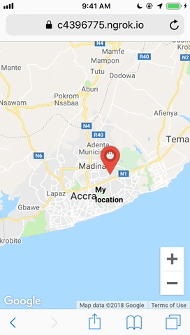

# Build a React Map Application with realtime location and online presence using Pusher Channels



<!-- [Link to Tutorial]() -->

## Prerequisite
- [React](https://reactjs.org) installed on your machine, you can read up on how to do that [here](https://facebook.github.io/create-react-app/docs/getting-started)
- [NodeJS](https://nodejs.org) installed on your machine
- [NPM](https://npmjs.com) or [Yarn](https://yarnpkg.com) installed on your machine

## Getting Started
- Install the necessary node modules

```bash
npm install
```

- [Obtain Pusher Crendtials](https://pusher.com)

- Enter Pusher Credentials in `src/App.js` and `server/server.js`

- [Obtain Google MAPs JavaScript API Credentials](https://developers.google.com/maps/documentation/javascript/get-api-key)

- Enter Google MAPs API Key in `src/App.js`

## Setting Up the Backend
- Change Directory and install node modules

```bash
cd server
npm install
```

- Start Backend Server

```bash
node server.js
```

## Update React Application
- Enter Backend Server URLs in `src/providers/pusher-service/App.js`


## Start React Application
- Run the command
```bash
npm start
```

- Open [http://localhost:3000](http://localhost:3000) to view it in the browser.

## Built with
- [Pusher](https://pusher.com) - APIs to allow you add realtime functionality and online presence features to your applications.
- [React](https://reactjs.org) - A JavaScript library for building user interfaces.